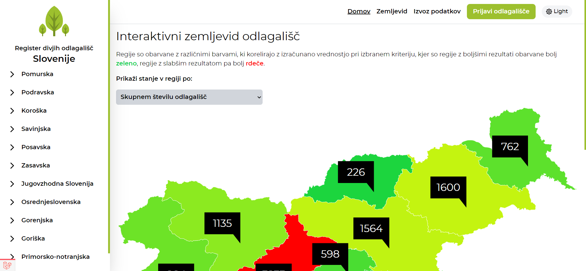
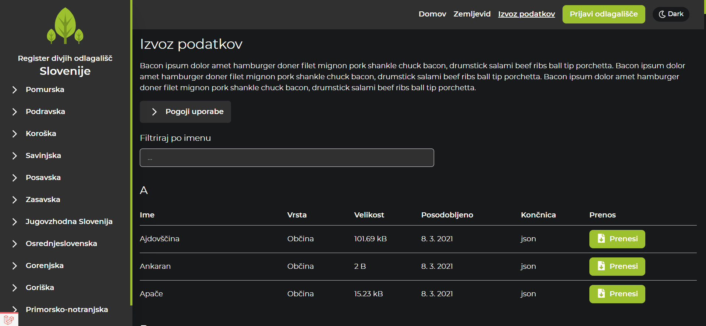

[](https://www.gnu.org/licenses/gpl-3.0)

# Slovenian register of illegal waste dumps

Slovenian register of illegal waste dumps is an environmental project which is intended to fight against illegal
waste dumps in Slovenia. It's providing users with a modern, effective and accessible system of reporting new illegal
dumping sites and updating previously recorded ones.

## Table of contents

* [Built with](#built-with)
* [Prerequisites](#requirements)
* [Installation guide](#installation-guide)
* [Views](#views)

## Built with

* [Tailwind CSS](https://tailwindcss.com) - A utility-first CSS framework packed with classes that can be composed to
  build any design, directly in your markup.
* [Vue 3](https://v3.vuejs.org) - Vue is a progressive framework for building user interfaces.
* [Vuex 4](https://vuex.vuejs.org) - Vuex is a state management pattern + library for Vue.js applications.
* [Inertia.js](https://inertiajs.com) - Inertia.js lets you quickly build modern single-page React, Vue and Svelte apps
  using classic server-side routing and controllers.
* [Laravel](https://laravel.com) - Laravel is a web application framework with expressive, elegant syntax.

## Requirements

* Node.js v16+
* Laravel v8+
* MySql v8+
* PHP v8.0+

## Installation guide

```sh
# initiate new database

# clone the project
git clone https://github.com/jurerotar/Slovenian-register-of-illegal-waste-dumps.git && cd Slovenian-register-of-illegal-waste-dumps

# install composer dependencies
composer install  

# create .env file, then input your database credentials in to .env file
php -r "file_exists('.env') || copy('.env.example', '.env');"

# generate application key
php artisan key:generate --ansi

# install node dependencies
npm install  

# migrate the database
php artisan migrate --seed

# run php development server on port 8000
php artisan serve  

# run vite development server on port 3000
npm run dev
```

## Views

Homepage in light color scheme



Data export page in dark color scheme




